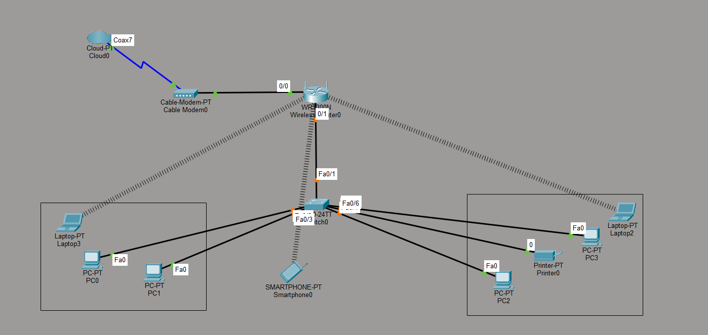
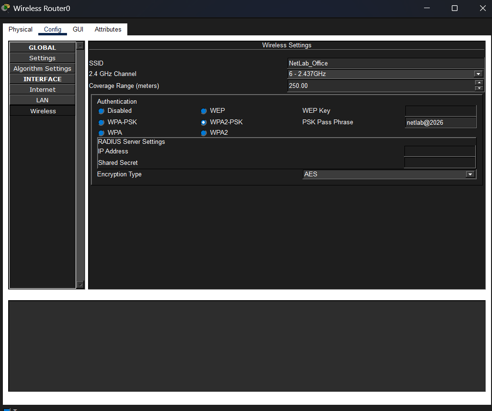
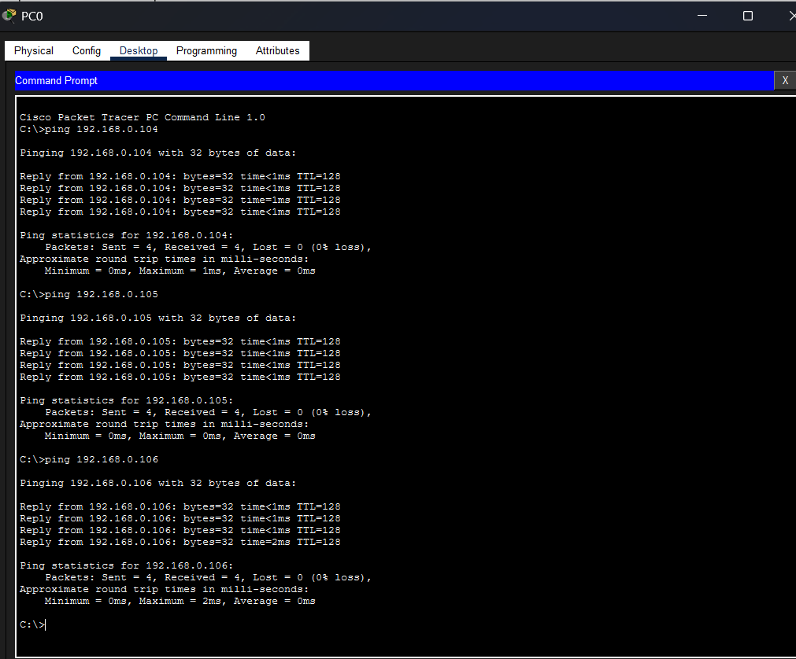

# 📡 Small Office Wireless Network using Cisco Packet Tracer

## 📖 Project Overview

Designed and configured a Small Office Wireless Network using Cisco Packet Tracer. Connected wired and wireless devices through a wireless router and switch, configured DHCP for automatic IP addressing, secured the wireless network using WPA2-PSK with AES encryption, and verified connectivity using ICMP ping and Packet Tracer Simulation Mode.

---

## 🖼️ Network Topology

---

## 📶 Wireless Configuration

- SSID: NetLab_Office
- Security: WPA2-PSK
- Encryption: AES
- IP Assignment: DHCP

---

## ✅ Connectivity Test

The network was successfully tested using ICMP Ping.

---

## 🛠️ Devices Used

- ISP Cloud
- Cable Modem
- Wireless Router
- Layer 2 Switch
- 4 PCs
- 2 Laptops
- Smartphone
- Network Printer

---

## 💻 Technologies

- Cisco Packet Tracer
- TCP/IP
- IPv4
- DHCP
- WLAN
- WPA2-PSK
- Ethernet Switching

---

## 🎯 Skills Demonstrated

- Network Design
- Router Configuration
- Switch Configuration
- Wireless Configuration
- DHCP
- Network Troubleshooting

---

